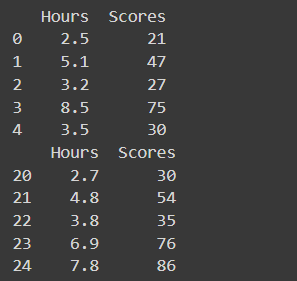
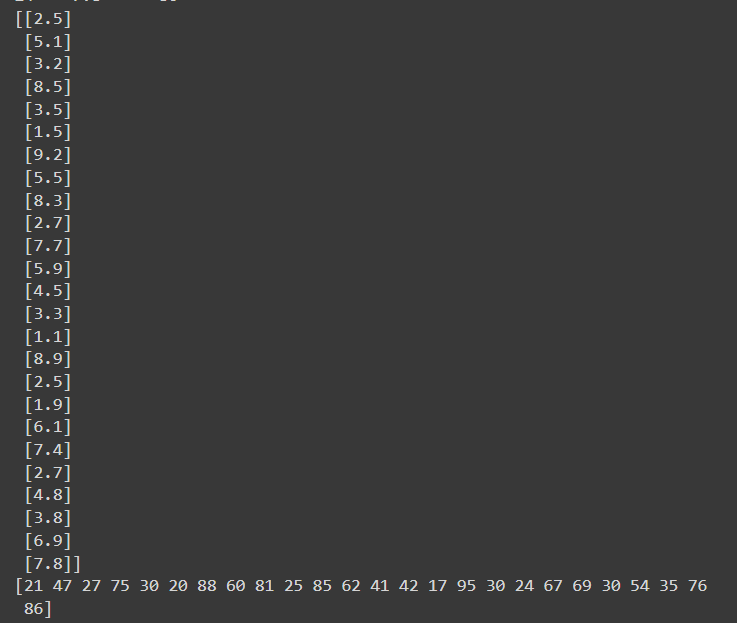
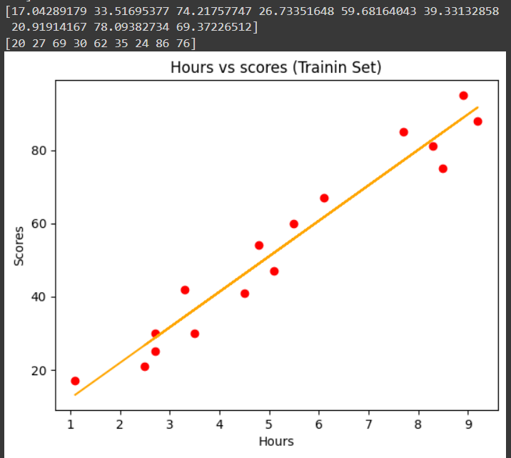
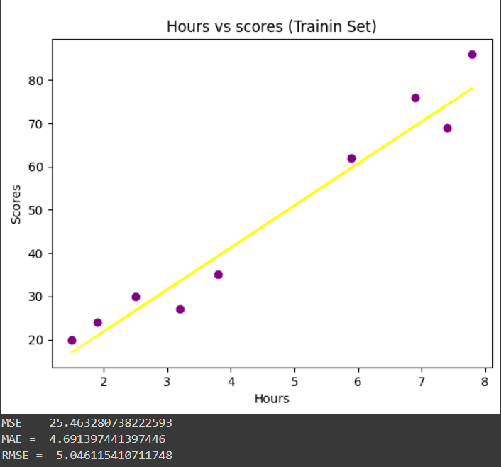

# Implementation-of-Simple-Linear-Regression-Model-for-Predicting-the-Marks-Scored

## AIM:
To write a program to predict the marks scored by a student using the simple linear regression model.

## Equipments Required:
1. Hardware – PCs
2. Anaconda – Python 3.7 Installation / Jupyter notebook

## Algorithm
1. Use the standard libraries in python.
2. Set variables for assigning dataset values.
3. Import LinearRegression from the sklearn.
4. Assign the points for representing the graph.
5. Predict the regression for marks by using the representation of graph.
6. Compare the graphs and hence we obtain the LinearRegression for the given datas.

## Program:
```
/*
Program to implement the simple linear regression model for predicting the marks scored.
Developed by: Renusri naraharashetty
RegisterNumber: 212223240139
*/

import pandas as pd
import numpy as np
import matplotlib.pyplot as plt
from sklearn.metrics import mean_absolute_error,mean_squared_error
df = pd.read_csv('/student_scores.csv')
print(df.head())
print(df.tail())
x=df.iloc[:,:-1].values
print(x)
y=df.iloc[:,1].values
print(y)
from sklearn.model_selection import train_test_split
x_train,x_test,y_train,y_test=train_test_split(x,y,test_size=1/3,random_state=0)
from sklearn.linear_model import LinearRegression
regressor=LinearRegression()
regressor.fit(x_train,y_train)
ypred=regressor.predict(x_test)
print(ypred)
print(y_test)

plt.scatter(x_train,y_train,color="red")
plt.plot(x_train,regressor.predict(x_train),color='orange')
plt.title("Hours vs scores (Trainin Set)")
plt.xlabel("Hours")
plt.ylabel("Scores")
plt.show()

plt.scatter(x_test,y_test,color="purple")
plt.plot(x_test,regressor.predict(x_test),color='yellow')
plt.title("Hours vs scores (Trainin Set)")
plt.xlabel("Hours")
plt.ylabel("Scores")
plt.show()

mse=mean_squared_error(y_test,ypred)
print('MSE = ',mse)
mae=mean_absolute_error(y_test,ypred)
print('MAE = ',mae)
rmse=np.sqrt(mse)
print("RMSE = ",rmse)

```

## Output:








## Result:
Thus the program to implement the simple linear regression model for predicting the marks scored is written and verified using python programming.
